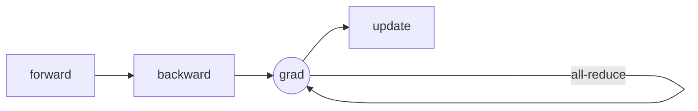

+++
title = 'Megatron-LM解读：DDP的原理和实现'
date = 2024-04-27T23:59:02+08:00
draft = false
math = true
busuanzi = true
+++

DDP(distributed data parallel)是大模型分布式学习框架最基础的内容，它允许将相同的模型参数副本放在不同的GPU设备上面，从而实现并行化计算，显著提高了训练效率。以下是DDP的一些关键特点：

1. **数据并行**：DDP通过将数据集分割成多个批次（batch），并将每个批次分配给不同的GPU来实现数据并行。
2. **模型复制**：在DDP中，模型的参数被复制到每个GPU上。每个GPU上的模型都会独立地进行前向和反向传播。
3. **梯度平均**：每个GPU计算出的梯度会在所有GPU之间进行平均，以确保所有模型参数的更新是一致的。
4. **易用性**：许多深度学习框架，如PyTorch，都提供了DDP的实现，使得开发者可以很容易地将其集成到现有的训练流程中。

深度学习依赖的mini-batch gradient descent算法本身就存在并行特点，多个输入之间不存在依赖，所以DDP是一种非常符合直觉的并行方式。因为每个节点上只保留了部分输入的梯度信息，所以在更新每个节点上的参数之前，需要对梯度进行求平均，这就需要用到多个进程间进行all-reduce操作。

## All-Reduce

all-reduce 操作可以通过多种方式实现，包括但不限于：

- **树状结构**：数据在进程间以树状结构进行归约，每个非叶子节点负责将其子节点的数据归约后再传递给其父节点。
- **环形结构**：进程之间形成一个环，数据在环中按顺序传递并归约。
- **直接归约**：所有进程直接将数据发送给一个中心节点，该节点完成归约后将结果发送回所有进程。

all-reduce 操作的性能对分布式计算的效率至关重要，因此优化这一操作是分布式系统设计中的一个研究热点。使用最多的实现方式是百度提出的Ring AllReduce算法，该方法属于环状结构实现的一种。下面我们简单介绍一下ring all-reduce是如何实现的 以及 为什么这么实现：

> 假设现在要传输的数据量是D，而group的大小（即参与通讯的节点数）是N，因为进行reduce操作的时间是比较快的，因此我们主要关注通讯上的差异。
>
> - 如果我们用直接规约的方式，即选择一个主节点，其余节点把数据发送过去进行reduce，然后再把数据复制到其他节点。
>
>   这种情况下主节点上进行最多的通讯，这2个步骤分别需要(N-1)D的通讯数据量，所以主节点上的通讯量是2(N-1)D，最终的时间和N是成正比的。改进的主要思路是充分利用每个节点上的带宽。
>
> - 有没可能让通讯时间和N不成正比，我们可以把reduce的数据分为N份，每个节点上分别进行上述操作，然后再把最终的1/N份结果发送到其他节点上。
>
>   此时每个节点上进行的通讯量都是2(N-1)D/N，理论上最终的时间只和D有关，而与集群大小无关。非常完美，但是如何实现才能保证传输压力是均匀的，Ring AllReduce就是这样一种方式。
>
> 更多的细节可以去阅读这篇文章：[Technologies behind Distributed Deep Learning: AllReduce - Preferred Networks Research & Development](https://tech.preferred.jp/en/blog/technologies-behind-distributed-deep-learning-allreduce/)

## Communication overlapping

DDP的一个基本流程就是，先在每个节点上进行前向推理，然后进行反向推理，前面这2个步骤都是节点间互相独立的。之后将每个节点上得到的梯度进行all-reduce，再进行参数的更新。如下图：

backward后可以产生grad，而all-reduce对grad进行平均，这2步分别调用的是计算核和通讯核，所以是可以并行做的。通常是先把节点上左右grad都计算出来，然后再进行all-reduce。了解流水线并行的朋友应该已经可以想到优化方法了，即把这2步看成流水线的2个stage，然后把grad切分成不同的部分，一边计算一边进行all-reduce，这就是overlaping，对应了megatron中的参数是`overlap_grad_reduce`。

其具体的原始是，将每个节点上的参数，按照backward调用到的顺序排列，并大致相同的buckets，每当一个bucket里面所有参数的grad都准备好的时候，就开始对这部分grad进行all-reduce，而不用等所有的backward做完。理想情况下，如果每个bucket里backward的时间和通讯时间相同，那么就相当于对全部grad进行all-reduce的时间减少到单个bucket进行all-reduce的时间。

### Inspiration for MoE structure

在MoE模型结构训练场景中，通讯占据了训练时间大量的比例，可能到60~70%，这大大的降低了MoE模型的训练速度，甚至超过同等效果模型所需要的训练算力。此时，overlapping作为软件层面一种主要的优化手段就显得尤为重要。MoE的all-to-all通讯也是可以分为不同的bucket，然后再进行计算，虽然实现起来可能很困难。并且带来的具体收益与GPU型号、通讯带宽、模型大小、并行设置等因素有关，需要具体情况具体分析。

但是这种思路显然是正确的，因此产产生出一些特殊的模型结构设计，能够更好的利用这种overlapping的能力，比如snowflake的最新发布的480B MoE模型。采用了一种Dense和MoE混合的架构，这种架构可以在主分支上产生出足够多的计算时间，从而用来隐藏MoE分支上面的通讯时间消耗。

### Bucket

一种最简单的bucket是每一个参数作为一个bucket，这样也最为简单。但是all-reduce的通讯数据量如果太小，不能充分利用带宽，因此实现的时候对bucket的大小有一定的要求。为了更好的对参数进行划分bucket，megatron中将所有的参数放到一个连续的内存buffer上面。

要理解这个过程，需要对pytorch中的Tensor结构有一定的了解。参考博客[PyTorch internals : ezyang’s blog](http://blog.ezyang.com/2019/05/pytorch-internals/)。pytorch中的Tensor可以分为 physical representation 和 logical view 2部分，前者决定数据类型和物理大小，后者决定tensor三要素size、strides、offset。

因此，多个tensor可以有不同的shape，但是可以共享同样的物理内存。也就意味着，我们可以把模型的参数都放在一个连续的内存上，同时用另外一个tensor表征整个连续内存空间，并在这个表征tensor上面进行划分buckets。另外，需要注意内存和数据类型是绑定的，所以megatron实现的时候需要给每个不同数据类型的参数创建一个单独的buffer。

## Code Implementation

代码在主要在`DistributedDataParallel`、`ParamAndGradBuffer` 和 `Bucket` 这3个类里面。

先看一下ParamAndGradBuffer中切分bucket的代码：

需要注意的地方有2个：

- 第一个是遍历模型参数是按照倒序排列的，所以大致上符合反向传播的顺序；

  这样可以大致使得每个bucket里的参数在backward的时候是相邻的，所以产生grad的时间也是相近的，从而尽快的进入all-reduce的阶段。

- 第二个是创建bucket条件，每个bucket中最后一个参数是完整的，并没有参数被切分开；

  差不多类似的原因。

反向传播产生grad后，自动开始进行all-reduce是通过hook回调实现的。如下面这段代码所示：

`redister_grad_ready`是buffer中的一个回调函数，但是最终执行的是bucket中的`register_grad_ready`函数。在改函数中判断当前bucket下的所有参数的grad是否全部计算完成，如果是则调用`Bucket`的`start_grad_sync`函数，并开始进行all-reduce。代码如下：

其中红框的位置，如果开启了distributed optimizer，则将原本的all-reduce改为了reduce-scatter。因为开启了distributed optimizer，每个节点上面其实只需要更新部分参数的梯度，具体的原理我们留到下一篇博客单独里讲。

